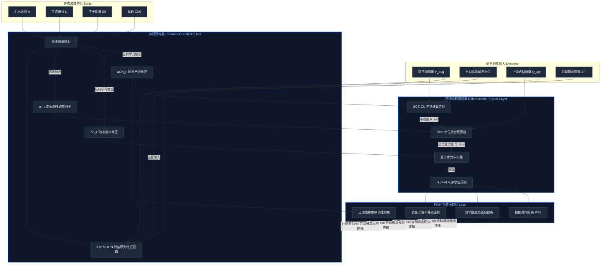

# 泛化 PINN 水文预报模型设计方案

## 1. 架构核心思想

基于目前已有的流域静态参数（面积、SCS、单位线）和动态监测设备（多雨量计、上游水位计），我们将采用 **“参数预测网络 (Parameter-Predicting NN) + 可微物理层 (Differentiable Physics Layer)”** 的混合架构。

神经网络**不直接预测最终水位**，而是基于实时气象和水文动态，预测随时间变化的隐式物理参数（如动态产流系数修正 $\Delta CN_t$ 和动态河道粗糙度 $\Delta n_t$）。最后通过内置的纯物理方程（SCS 产流 + 汇流 + 曼宁公式）计算最终水位。这一架构剥离了流域固有几何特征，实现了模型在不同小流域间的极速迁移（Zero-shot 或 Few-shot Transfer）。

### 1.1 核心架构图解

## 2. 数据输入与预处理层

模型输入分为“静态特征”和“动态时序特征”两部分：

### 2.1 静态流域特征 (Static Embedding)
直接继承自现有界面的计算结果，让网络感知流域尺度：
*   **汇水面积 $A$** ($km^2$)
*   **主沟道/干流总长 $L$** ($km$)
*   **主干流平均比降 $S_0$**
*   **基础先验参数**：初始 $CN_0$ 值，初始曼宁系数 $n_0$，基流汇流时间 $T_c$

### 2.2 动态气象与水文特征 (Dynamic Sequence)
基于**“汇水口必定配置 5 分钟级雨量计和水位计”**的优化假设，数据预处理得以极大强化：
1.  **面雨量场泛化 (Areal Rainfall)**：以汇水口雨量计作为时间分辨率基准（Base Reference）。将上游和集雨面积内的其他雨量计通过空间权重算子（如泰森多边形或反距离权重 IDW）进行空间插值，融合为**面平均雨量 $P_{avg}(t)$** 和 **降雨方差 $P_{var}(t)$**，输入频率严格对齐为 5 分钟。
2.  **上游边界条件泛化 (Upstream Inflow)**：
    *   **无实测宽深比的解决方案（虚拟水位-流量映射）**：针对大多数小流域缺乏实测断面数据的情况，我们不要求强制输入宽深比。而是引入 **PINN 逆向反演机制**：
        1.  **先验估算**：利用系统现有的 GIS 引擎，自动提取上游水位计对应的上方控制面积 $A_{up}$ 和河道比降 $S_{up}$。根据天然河道地貌关系估算初始参考底宽 $W_{prior} \approx 2.5 \sqrt{A_{up}}$。
        2.  **可学习尺度因子**：在可微物理层中构建虚拟流量公式 $Q_{up}(t) = \alpha \cdot \frac{W_{prior} \sqrt{S_{up}}}{n} H_{up}(t)^{5/3}$。
        3.  **自动校准**：尺度因子 $\alpha$ 作为神经网络的可训练参数（初始值为 1.0）。在微调（Fine-tuning）阶段，PINN 会为了让下游出口的水位预测准确，自动通过反向传播调整 $\alpha$ 的值。这样，$\alpha$ 就隐式地“吸收”了真实河道的宽度、断面形状和粗糙度误差。
    *   **可选配置（兼容无上游站场景）**：由于实际历史数据中，部分场景**只有汇水口水位和雨量**，因此 $Q_{up}(t)$ 在网络中被设计为“可选向量 (Masked Vector)”。如果当前配置的预报站没有上游计，系统将输入默认全零向量，并将 $\alpha$ 因子屏蔽，完全依靠面雨量驱动产流，保障模型的高可用性。
    *   **滞后演进**：根据上游站点距出口的河长和比降，计算出一个物理滞后时间 **$\Delta t_{lag}$**。上游输入特征定义为经过平移和衰减的延迟流量 $Q_{up}(t-\Delta t_{lag})$。
3.  **出口自回归状态反馈 (Autoregressive State Input)**：既然出口处永远有 5 分钟级的水位观测值 $H_{obs}(t)$，我们将过去 1 小时（12 个时间步）的出口水位增量序列 $[H_{obs}(t-12), \dots, H_{obs}(t)]$ 直接作为模型的输入。这允许网络感知当前河道的“底水”状态和“涨落势头”。
4.  **前期影响雨量 (API)**：滚动计算 5 日前期降雨量，表征土壤初始含水率。

---

## 3. 模型网络结构设计

模型分为两段式前向传播流程：

### 第一层：神经网络层 (Neural Network Block - Autoregressive)
*   **输入**：$[P_{avg}(t), P_{var}(t), Q_{up}(t-\Delta t_{lag}), H_{obs}(t_{past}), API, A, L, S_0, CN_0]$
*   **网络骨架**：采用 LSTM 或 TCN（时域卷积网络）提取时序时空特征。由于引入了 $H_{obs}(t_{past})$，模型具备了强大的“数据同化 (Data Assimilation)”能力，能消除长效误差累积。
*   **输出**：当前时刻的物理状态修正系数：
    *   $\Delta CN(t)$：受连续降雨土壤饱和度影响的产流能力变化。
    *   $\Delta n(t)$：受水深和植被淹没情况影响的曼宁粗糙度变化。

### 第二层：可微物理层 (Differentiable Physics Block)
使用 PyTorch 的张量运算实现现有的物理逻辑，使其全程可导：
1.  **产流计算**：采用动态的 $CN_{t} = CN_0 + \Delta CN(t)$，通过 SCS 公式计算净雨量 $R_{net}(t)$。
2.  **汇流演进**：利用无量纲单位线（由静态参数 $A, L, S_0$ 生成），将 $R_{net}(t)$ 进行卷积运算，加上衰减后的上游流量 $Q_{up}$，得到出口断面总流量 $Q_{total}(t)$。
3.  **水位转换**：采用动态的 $n_{t} = n_0 + \Delta n(t)$，通过曼宁公式反解出预测水位 $H_{pred}(t)$。

---

## 4. 损失函数与物理约束 (PINN Loss)

总损失函数 $\mathcal{L} = \mathcal{L}_{Data} + \lambda_1 \mathcal{L}_{Mass} + \lambda_2 \mathcal{L}_{Physics} + \lambda_3 \mathcal{L}_{Gradient}$

*   **数据损失 ($\mathcal{L}_{Data}$)**：未来 60 分钟预测水位 $H_{pred}$ 与出口 5 分钟实测水位的 MSE（均方误差）。
*   **边界梯度损失 ($\mathcal{L}_{Gradient}$ - 新增优化)**：由于出口水位必定有高频观测，我们可以强制模型预测的水位变化率 $\frac{dH_{pred}}{dt}$ 贴合实测的涨落率 $\frac{dH_{obs}}{dt}$。这能极大地抑制模型在洪峰到来时出现“剧烈震荡”或“相位滞后”。
*   **质量守恒约束 ($\mathcal{L}_{Mass}$)**：出口排出的总水量（通过预测水位估算的流量积分）必须 $\le$ 降雨总产水量 + 上游累计来水量。
*   **物理先验约束 ($\mathcal{L}_{Physics}$)**：对神经网络的输出进行限制，例如 $\Delta CN$ 必须在合理的物理衰减范围内，且随着降雨持续，土壤饱和度只能增加（即 $CN_t$ 在停雨前单调递增约束）。

---

## 5. 训练与工程部署策略

为了实现“快速应用到其他小流域”，采用以下两步走策略：

### Phase 1: 离线全局预训练 (Global Pre-training)
收集系统中已有历史站点的所有样本数据，将多个小流域的数据合并训练这**一个**模型。此时模型学会的是跨流域的宏观规律（例如：不管哪个流域，雨下久了 $CN$ 都会升高；坡度越陡的地方 $T_c$ 的权重越敏感）。

### Phase 2: 新站点小样本微调 (Few-shot Fine-tuning)
当系统在一个全新配置的预报站点启用时：
1.  **冷启动 (Zero-shot)**：直接传入新站点的 $A, L, S_0$ 等特征，冻结网络权重，此时系统退化为一个拥有合理动态参数的高级物理模型，直接可用。
2.  **在线学习 (Fine-tuning)**：当新站点收集到 3-5 场有效降雨事件后，**冻结神经网络的前端特征提取层，仅开放最后输出 $\Delta CN$ 和 $\Delta n$ 的全连接层进行微调（耗时通常小于 30 秒）**。模型即刻掌握该流域独有的局部土壤与植被偏好。

